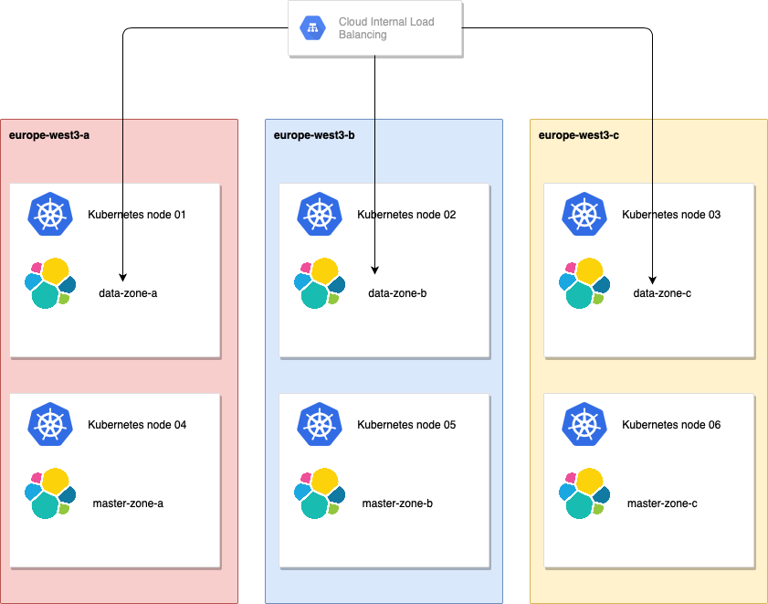

# ECK
- - - - 

This is a collection of showcase example to help you to use **Elastic Cloud on Kubernetes** on **GCP** as a real production environment using the following features:

- dedicated nodes
- zone awareness
- repository plugin
- node & pod affinity
- readiness rrobe
- pod disruption budget
- update strategy

### Before start
If you wanna run this example without make any change on the manifest, please make sure you're using the following configuration:
- GKE node pool with a Kubernetes label called **pool** : **elasticsearch**
- Kubernetes namespace called **infra**
- GKE Cluster running on **europe-west3** region

### Content
- StorageClass manifest
- Elasticsearch manifest

### Features implemented

- [HTTP Settings](#http-settings "Go to HTTP Settings")
- [Node Configuration](#node-configuration)
- [Volume Claim](#volume-claim)
- [Node Affinity & Pod Affinity](#node-affinity-&-pod-affinity)
- [Readiness Probe](#readiness-probe)
- [JVM](#jvm)
- [InitContainer](#initcontainer)
- [updateStrategy](#updateStrategy)
- [podDisruptionBudget](#podDisruptionBudget)

### Architecture 
- 6 GKE Instance type: **e2-standard-2 (2 vCPUs, 8 GB memory)**
- 3 Elasticsearch data node (30Gi disk, 2Gi JVM, 4Gi memory)
- 3 Elasticsearch master node (10Gi disk, 1Gi JVM, 2Gi memory)




### Manifest explained
This section will guide you to understand each piece of Elasticsearch manifest.

#### HTTP Settings ####
Here we're creating a Internal loadbalancer on GCP attaching **only** data nodes on it. The default behavior will create a service with all Elasticsearch nodes attached which works perfect, but here I'm removing master node from the LoadBalancer so they can focus on maintaining global cluster state.

```apiVersion: elasticsearch.k8s.elastic.co/v1
kind: Elasticsearch
metadata:
  name: elastic-prod
  namespace: infra
spec:
  http:
    service:
      metadata:
        annotations:
          cloud.google.com/load-balancer-type: Internal
          elasticsearch.k8s.elastic.co/node-master: "false"
      spec:
        type: LoadBalancer
```

#### Node Configuration
We can relate this section with elasticsearch.yml file, which means we're defining one Elasticsearch node name called **data-zone-a** as a data node. You can see that the other roles are disabled.

We're also defining routing allocation called **zone** and attributing the routing for a specific zone **europe-west3-a**.

By default, Elasticsearch uses memory mapping (mmap) to efficiently access indices. Usually, default values for virtual address space on Linux distributions are too low for Elasticsearch to work properly, which may result in out-of-memory exceptions, that's why we're using **node.store.allow_mmap : false**


```
  nodeSets:
  - name: data-zone-a
    count: 1
    config:
      node.attr.zone: europe-west3-a
      cluster.routing.allocation.awareness.attributes: zone
      http.max_content_length: 200mb
      node.data: true
      node.ml: false
      node.ingest: false
      node.master: false
      node.store.allow_mmap: false
```

#### Volume Claim
For production workloads is highly recommended to configure your own volume claim template with the desired storage capacity. Here we're using a StorageClass called **fast-europe-west3** with 30Gi.


```
    volumeClaimTemplates:
    - metadata:
        name: elasticsearch-data
      spec:
        accessModes:
        - ReadWriteOnce
        resources:
          requests:
            storage: 30Gi
        storageClassName: fast-europe-west3
```

#### Node Affinity & Pod Affinity
The affinity feature restrict scheduling pods in a group of Kubernetes nodes based on labels.Node affinity is conceptually similar to **nodeSelector** which defined in qhich nodes your pod will be scheduled on based on the label. nodeAffinity greatly extends the types of constrains you can express using enhancements labels.

`podAntiAffinity` will prevent scheduling Elasticsearch nodes on the same host.

In this example `podAffinity` & `nodeAffinity` are using **requiredDuringSchedulingIgnoredDuringExecution** affinity type. That means, a **hard** limit which rules must be met for a pod to be scheduled in a node. In this example, we're defining something like: "only run the pod on nodes in a zone **europe-west3-a** AND with a label called **pool** : **elasticseasrch**". By doing this, we have the guarantee that Elasticsearch node will be started only on those nodes.


```
    podTemplate:
      spec:
        affinity:
          nodeAffinity:
            requiredDuringSchedulingIgnoredDuringExecution:
              nodeSelectorTerms:
              - matchExpressions:
                - key: failure-domain.beta.kubernetes.io/zone
                  operator: In
                  values:
                  - europe-west3-a
              - matchExpressions:
                - key: pool
                  operator: In
                  values:
                  - elasticsearch
          podAntiAffinity:
            requiredDuringSchedulingIgnoredDuringExecution:
            - labelSelector:
                matchLabels:
                  elasticsearch.k8s.elastic.co/cluster-name: elastic-prod
              topologyKey: kubernetes.io/hostname
        nodeSelector:
          pool: elasticsearch
```

#### Readiness Probe
Readiness probe is used to know when a container is ready to start accepting traffic. Here we're increasing the timeout from 3 to 10 seconds.

```
        containers:
        - name: elasticsearch
          readinessProbe:
            exec:
              command:
              - bash
              - -c
              - /mnt/elastic-internal/scripts/readiness-probe-script.sh
            failureThreshold: 3
            initialDelaySeconds: 10
            periodSeconds: 12
            successThreshold: 1
            timeoutSeconds: 12
          env:
          - name: READINESS_PROBE_TIMEOUT
            value: "10"
```

#### JVM
Our dead JVM configuration is defined using a environment variable, as usual we're using half of memory to JVM.

```
          - name: ES_JAVA_OPTS
            value: -Xms2g -Xmx2g
```

#### Resources definition
We're defining `request` & `limit` with the same value to minimize disruption caused by pod evictions due a resources utilization. In this example I'm using nodes with 6Gi of memory.

Keep in mind if you don't explicitly define the resources, Elasticsearch will start with 2Gi requests/limits .
```
          resources:
            limits:
              memory: 4Gi
            requests:
              memory: 4Gi
```

#### InitContainer
To install plugins we need to define a initContainers to download & install before the Elasticsearch node start. As this example is prepered to be executed into production environment, snapshots are a crutial feature for this workload.

```
        initContainers:
        - command:
          - sh
          - -c
          - |
            bin/elasticsearch-plugin install --batch repository-gcs
          name: install-plugins
```

#### updateStrategy
We're defining `updateStrategy` to control number of simultaneous changes in the Elasticsearch cluster. `maxSurge: 1` means only one new Pod is created at a time. After the first new Pod is Ready, an old Pod is killed and the second new Pod is created. Where `maxSurge` determines how many new Pods to create, `maxUnavailable` determines how many old Pods to kill. In this case, we can only kill 1 old Pod at a time. This ensures the capacity is always at least 3 - 1 Pods.

```
  updateStrategy:
    changeBudget:
      maxSurge: 1
      maxUnavailable: 1
```

#### podDisruptionBudget
Here we're saying we need at least 2 Elasticsearch nodes running in case of disruption while Kubernetes cluster administrator manage Kubernetes nodes. It will prevent a good health in your cluster.

```
  podDisruptionBudget:
    spec:
      minAvailable: 2
      selector:
        matchLabels:
          elasticsearch.k8s.elastic.co/cluster-name: elastic-prod
```

### To be implemented

- Setup my own certificate
- Cronjob with snapshot config
